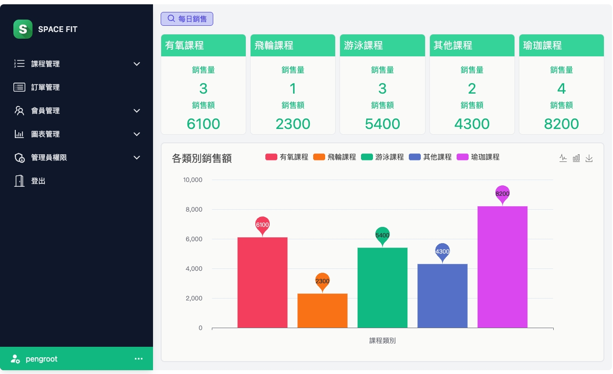

<div align="center">


# SPACE FIT 健身網站 - 後台管理系統 
</div>

> ⚠ 測試操作請同時下載前台、伺服器資料包 : <br>
前台 --> https://github.com/Jam-Peng/space_fit_frontend <br>
伺服器 --> https://github.com/Jam-Peng/space_fit_server

>⚠ 由於資料庫部署 Aws 選擇較低的 CPU 配置，影響應用程序與數據庫查詢的時間增加，降低網頁加載速度，建議可下載至本地端運行。


###  Preview :

<table width="100%"> 
<tr>
<td width="50%">      
&nbsp; 
<br>
<p align="center">
  Ｈome - Login
</p>

</td> 
<td width="50%">
<br>
<p align="center">
  Dashboard - Sale Chart
</p>

</td>
</tr>
</table>

#

## 專案說明
- 模擬健身中心售課網站與後台管理系統。
- 透過 Flask API 將後台與伺服器做資料的整合與應用。
- 測試部署資料庫於 aws-RDS 運行。
- <a href="https://drive.google.com/file/d/13Z1jdBGDP95JCOCd2z3zKP7JwtV1Wgn5/view?usp=sharing" target="_blank">開啟線上完整專案指南</a>

#
### 使用環境
- `JavaScript`

---
### 使用技術
- 以 `Vite + React` 框架開發
- 使用 `Tailwind CSS` 框架與手刻 `CSS` 進行切版
- 使用 `React` 的 `createContext`，作為狀態管理工具
- 透過 `echarts` 庫將資料繪製成圖表

### 使用套件
- `react`
- `react-dom`
- `react-router-dom`
- `react-spinners`
- `geopy`
- `timezonefinder`
- `axios`
- `Tailwind CSS`
- `jwt-decode`
- `echarts`


## 如何執行 - `前、後台`
--> 使用 Zip 下載專案或使用下面的指令下載
```bash
git clone https://github.com/Jam-Peng/space_fit_backend.git
```

--> 安裝 NodeJS 開源跨平台JavaScript運行環境與NPM套件管理工具
> NodeJS下載安裝 --> https://nodejs.org/en

--> 進入前台資料包
```bash
cd frontend
```

--> 或進入後台資料包
```bash
cd backendend
```

--> 安裝專案需求 dependencies
```bash
npm install
```

--> 執行專案
```bash
npm run server
```

